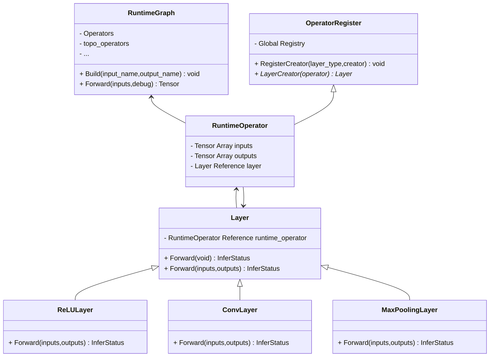

# BuzzNet Project README

## Overview
This application provides a range of functionalities including chat, posting, deleting posts, and video calling. The application primarily runs on the Windows system. However, the video calling function is optimized for macOS due to compatibility with the built-in camera.

## System Requirements
- **Windows**: Supports most functions except video calling.
- **macOS**: Required for video calling functionality.

## Dependencies
- **Node.js**: Runtime environment for executing JavaScript code server-side.
- **npm Packages**:
  - `multer`: For handling file uploads and posting.
  - `sqlite3`: For database operations related to postings.
- **OpenCV**: Required for video calling feature.

## Installation Steps

1. **Install Node.js**: Ensure that Node.js is installed on your system. It can be downloaded from [Node.js official website](https://nodejs.org/).

2. **Install npm Packages**: Run the following commands in the terminal to install necessary npm packages:
   ```bash
   npm install multer
   npm install sqlite3
Note: These commands should be run in the directory where your project is located.

3. **OpenCV**: Ensure OpenCV is set up correctly for video calling. This is particularly relevant for macOS users. Refer to the [OpenCV official guide](https://opencv.org/) for installation instructions.

## Running the Application

1. Open a terminal.

2. Navigate to your project directory.

3. Run the server using the command:
   ```bash
    node server.js
4. The website should launch automatically in your default web browser. If it does not, copy the URL provided in the terminal and paste it into your browser.

5. Log in using one of the three available accounts.

6. You can now access the various functionalities:
- Chat (click on the chat icon)
- Post/Delete postings
- Video calling (requires macOS)
- Log out

For posting, you can input either text or pictures.

## Video Calling

- Video calling requires two devices with different IP addresses.
- In the demonstration video, the process showcases sending and receiving video on the same device. If needed, a demonstration of a two-device video call can be provided.

## Additional Notes

- For the best experience with video calling, ensure that two different devices are used.
- If there are any issues or further clarifications needed, please refer to the project documentation or contact the project team.



